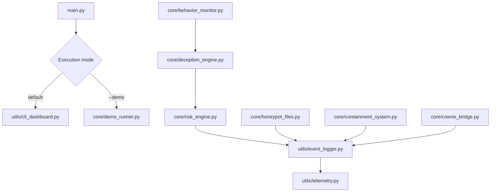
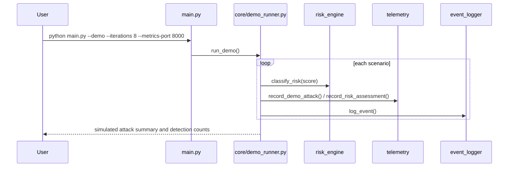
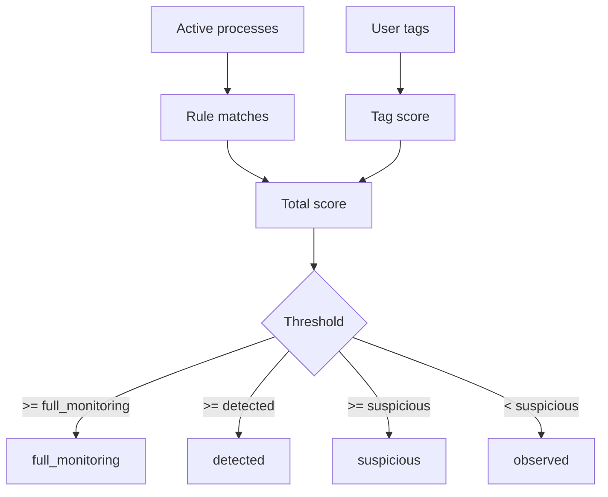

# 🛡️ GGS: Guardian Graph System

GGS is a modular active-defense prototype for Linux. The repository combines structured logging, Prometheus telemetry, rule-based risk scoring, honeypots and decoys, experimental containment, and a Cowrie event bridge.

## What is implemented today

- `main.py` starts the CLI dashboard by default and can switch to demo mode with `--demo`.
- `utils/event_logger.py` writes structured JSON events to disk and updates telemetry counters.
- `utils/telemetry.py` exposes Prometheus counters and gauges.
- `core/risk_engine.py` classifies risk from scores and threshold rules.
- `core/behavior_monitor.py` tags users according to behavior rules when such rules are present in the loaded config.
- `core/deception_engine.py` combines active processes, rules, and tags into a per-user risk summary.
- `core/honeypot_files.py` creates, monitors, and recreates decoy files and a honeypot process.
- `core/containment_system.py` applies severity-based containment actions from external configuration.
- `core/cowrie_bridge.py` parses Cowrie JSON events and emits them as GGS events.
- `utils/cli_dashboard.py` renders tagged users, risk levels, and an events panel with Rich.
- `run_tests.py` prepares the test environment, regenerates decoys, and runs `pytest`.

## Configuration overview

The default configuration is defined in [config.yaml](config.yaml) and the containment severity map lives in [configs/config_levels.yaml](configs/config_levels.yaml).

### [config.yaml](config.yaml)

This file currently defines:

- `scan_interval`: default process scan interval in seconds.
- `honeypot_path`: location for decoy files.
- `log_file`: structured event log destination.
- `rules`: process-matching rules with `process_name`, `cmd_contains`, and `tag`.
- `risk_levels`: thresholds for `suspicious`, `detected`, and `full_monitoring`.
- `actions`: declarative response flags per risk level.
- `honeypots`: enabled decoys and their filenames.
- `containment`: Docker image and network/encryption monitoring flags.
- `notifications`: webhook settings for external alerts.

### [configs/config_levels.yaml](configs/config_levels.yaml)

This file maps severity levels to response profiles:

- `level_1` is low-risk, logging and process monitoring only.
- `level_2` adds increased monitoring and optional network capture.
- `level_3` enables Docker isolation, network capture, and process termination.

The file also includes detection patterns and escalation thresholds for file modifications and process attempts.

## Architecture



## Demo flow



## Cowrie integration

```mermaid
flowchart LR
    A[Cowrie JSON log] --> B[core/cowrie_bridge.py]
    B --> C[parse_cowrie_event()]
    C --> D[emit_cowrie_event()]
    D --> E[utils/event_logger.py]
    E --> F[JSONL log + telemetry]
```

The bridge extracts fields such as `event_id`, `src_ip`, `username`, `password`, and `command`, then records them as structured GGS events. If a webhook URL is provided, the event can also be forwarded externally.

## Risk scoring

Risk classification is currently based on two inputs:

- Matching active processes against process rules loaded from `config.yaml`.
- User tags accumulated by `core/behavior_monitor.py`.

`core/risk_engine.py` reduces the resulting score to four levels:

- `observed`
- `suspicious`
- `detected`
- `full_monitoring`



## Installation

### Local

```bash
git clone https://github.com/jurgen-dev/GGS.git
cd GGS
python -m venv venv
venv\Scripts\activate
pip install -r requirements.txt
```

On Linux or macOS, activate the environment with `source venv/bin/activate`.

### Docker

```bash
docker compose up --build
```

This starts the demo, Cowrie, the Cowrie bridge, and Prometheus according to [docker-compose.yml](docker-compose.yml).

## Usage

### CLI dashboard

```bash
python main.py
```

### Demo with metrics

```bash
python main.py --demo --iterations 8 --metrics-port 8000
```

### Tests

```bash
python run_tests.py
```

The test runner clears `test_system_events.log`, regenerates `test_decoys/`, and runs `pytest tests/`.

## Validation

The current test suite verifies that:

- `run_demo(iterations=4)` reports 3 detections out of 4 simulated scenarios.
- `log_event()` writes structured JSON entries.
- `parse_cowrie_event()` and `emit_cowrie_event()` handle Cowrie payloads correctly.
- `load_rules()` reads configuration from YAML.

That gives the demo a reproducible detection rate of 75% in the covered test scenario.

## Project structure

```text
GGS/
├── core/
│   ├── behavior_monitor.py
│   ├── containment_system.py
│   ├── cowrie_bridge.py
│   ├── deception_engine.py
│   ├── demo_runner.py
│   ├── honeypot_files.py
│   └── risk_engine.py
├── utils/
│   ├── cli_dashboard.py
│   ├── config_manager.py
│   ├── event_logger.py
│   └── telemetry.py
├── configs/
│   └── config_levels.yaml
├── tests/
│   ├── test_config.yaml
│   └── ...
├── config.yaml
├── docker-compose.yml
├── main.py
├── prometheus.yml
├── readme.md
└── run_tests.py
```

## Notes

- The project is Linux-first: several modules depend on `/proc`, `psutil`, Docker, and optional network capture.
- `pyshark` is optional at runtime, but network capture usually also requires `tshark` on the host.
- `prometheus_client` is used for the local demo and dashboard metrics.

## License

This project is licensed under the GNU General Public License v3.0 (GPLv3).
