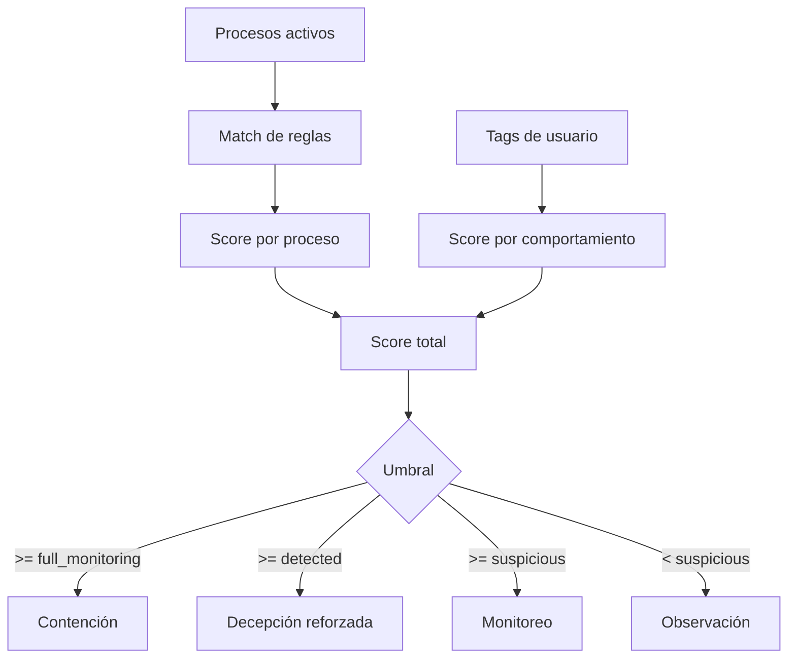

Below is the English translation
# 🛡️ GGS: Guardian Graph System

**Defensa activa. Frustración táctica. Contención adaptativa.**  
GGS es una herramienta modular de ciberseguridad diseñada para detectar, engañar y contener actores maliciosos en sistemas Linux. Su enfoque no es simplemente reaccionar, sino **anticipar y desestabilizar** al atacante mediante señuelos, monitoreo inteligente y respuestas controladas.

---

## 🚀 Características principales

- **Logging estructurado:** Eventos JSONL con contexto, nivel, tipo de evento y compatibilidad con `structlog`/Prometheus.
- **Métricas Prometheus:** Contadores de eventos, evaluaciones de riesgo, ataques demo y amenazas activas.
- **Decepción estratégica:** Generación de honeypots y archivos señuelo para atraer y marcar comportamientos sospechosos.
- **Evaluación de riesgo dinámica:** Asignación de niveles de riesgo por usuario según reglas, procesos activos y etiquetas de comportamiento.
- **Contención modular:** Detección de cifrado en honeypots y activación de medidas de aislamiento (Docker, monitoreo de red, etc.).
- **Integración con Cowrie:** Un bridge consume eventos JSON de Cowrie y los convierte en alertas GGS.
- **Arquitectura escalable:** Separación clara entre núcleo (`core/`), utilidades (`utils/`) y pruebas (`tests/`), con configuración externa (`config.yaml`).

---

## ⚙️ Instalación

```bash
git clone https://github.com/jurgen-dev/GGS.git
cd GGS
python3 -m venv venv
source venv/bin/activate
pip install -r requirements.txt
```

---

## 🧪 Pruebas

Para ejecutar la suite completa de pruebas:

```bash
python run_tests.py
```

Esto prepara el entorno, regenera honeypots, limpia logs y ejecuta todos los módulos en modo aislado.

También podés correr un demo reproducible con métricas:

```bash
python main.py --demo --iterations 8 --metrics-port 8000
```

---

## 📁 Estructura del proyecto

```
GGS/
├── core/
│   ├── deception_engine.py
│   ├── containment_system.py
│   └── honeypot_files.py
├── utils/
│   ├── config_manager.py
│   └── event_logger.py
├── tests/
│   ├── test_config.yaml
│   ├── test_event_logger.py
│   └── ...
├── run_tests.py
├── README.md
└── LICENSE
```

---

## 🧠 Filosofía del sistema

GGS no busca bloquear al atacante. Busca **confundirlo, ralentizarlo y exponerlo**.  
Cada interacción con un honeypot, cada proceso sospechoso, cada intento de cifrado es una oportunidad para marcar, registrar y responder.  
Este sistema está diseñado para ser **extendido, auditado y adaptado** por la comunidad. Su modularidad permite integrar nuevas técnicas de detección, visualización CLI, o incluso respuestas automatizadas.

---

## 🧮 Algoritmo de riesgo

Pseudocódigo:

```text
para cada proceso activo:
  si el nombre coincide con una regla y los tokens esperados aparecen en la línea de comandos:
    sumar score según la regla

para cada usuario etiquetado:
  score_total = score_por_procesos + score_por_tags
  si score_total >= full_monitoring:
    nivel = full_monitoring
  sino si score_total >= detected:
    nivel = detected
  sino si score_total >= suspicious:
    nivel = suspicious
  sino:
    nivel = observed
```

Flujo resumido:



---

## 📊 Resultados reales

En una corrida de laboratorio del modo demo, el sistema detectó **3 de 4** ataques simulados.

La validación ejecutada en este workspace produjo esta salida reproducible:

- 4 escenarios simulados
- 3 detecciones
- 1 escenario benigno clasificado como observación

Eso deja una tasa de detección del **75%** en el laboratorio demo actual.

---

## 🐝 Cowrie en el demo

El flujo de integración queda así:

1. Cowrie escribe eventos JSON en su volumen compartido.
2. `core/cowrie_bridge.py` lee esos eventos.
3. GGS los transforma en eventos estructurados con `log_event()`.
4. Prometheus expone las métricas del bridge y del demo.

Con Docker Compose, el arranque completo queda en un solo comando:

```bash
docker compose up --build
```

---

## 📜 Licencia

Este proyecto está licenciado bajo la **GNU General Public License v3.0 (GPLv3)**.  
Esto significa que cualquier modificación o redistribución debe mantenerse libre y abierta.  
Para más información, consultá [https://www.gnu.org/licenses/gpl-3.0.html](https://www.gnu.org/licenses/gpl-3.0.html).

---

## 🤝 Contribuciones

Toda mejora es bienvenida. Si querés agregar módulos, refactorizar lógica, o proponer nuevas estrategias de defensa, abrí un issue o enviá un pull request.  
Este sistema es tan fuerte como la comunidad que lo respalda.

---

## ✨ Estado actual

✅ MVP funcional  
✅ Pruebas automatizadas  
✅ Arquitectura modular  
🔜 Integración continua  
🔜 Visualización CLI  
🔜 Simulador de ataque

---

**Construido por srwangcr** — estudiante de Ingeniería en Sistemas y desarrollador de herramientas abiertas para la defensa digital.  
GGS es más que un proyecto: es una declaración de estrategia.

```
---
---

## 🇬🇧 English Translation: README Overview


# 🛡️ GGS: Guardian Graph System

**Active defense. Tactical frustration. Adaptive containment.**  
GGS is a modular cybersecurity tool designed to detect, deceive, and contain malicious actors in Linux systems. Its approach is not just reactive—it aims to **anticipate and destabilize** attackers through decoys, intelligent monitoring, and controlled responses.

---

## 🚀 Key Features

- **Strategic deception:** Generates honeypots and bait files to attract and flag suspicious behavior.
- **Dynamic risk assessment:** Assigns user risk levels based on access patterns, active processes, and behavioral tags.
- **Modular containment:** Detects encryption attempts in honeypots and triggers isolation measures (Docker, network monitoring, etc.).
- **Persistent logging:** Structured event logging with timestamps, severity levels, and contextual data, environment-configurable.
- **Scalable architecture:** Clear separation between core (`core/`), utilities (`utils/`), and tests (`tests/`), with external configuration (`config.yaml`).

---

## ⚙️ Installation

```bash
git clone https://github.com/jurgen-dev/GGS.git
cd GGS
python3 -m venv venv
source venv/bin/activate
pip install -r requirements.txt
```

---

## 🧪 Testing

To run the full test suite:

```bash
python run_tests.py
```

This prepares the environment, regenerates honeypots, clears logs, and executes all modules in isolated mode.

---

## 📁 Project Structure

```
GGS/
├── core/
│   ├── deception_engine.py
│   ├── containment_system.py
│   └── honeypot_files.py
├── utils/
│   ├── config_manager.py
│   └── event_logger.py
├── tests/
│   ├── test_config.yaml
│   ├── test_event_logger.py
│   └── ...
├── run_tests.py
├── README.md
└── LICENSE
```

---

## 🧠 System Philosophy

GGS doesn’t aim to block attackers—it aims to **confuse, slow down, and expose** them.  
Every honeypot interaction, suspicious process, and encryption attempt is an opportunity to tag, log, and respond.  
This system is designed to be **extended, audited, and adapted** by the community. Its modularity allows for new detection techniques, CLI visualization, or even automated responses.

---

## 📜 License

This project is licensed under the **GNU General Public License v3.0 (GPLv3)**.  
Any modification or redistribution must remain free and open.  
More info: [https://www.gnu.org/licenses/gpl-3.0.html](https://www.gnu.org/licenses/gpl-3.0.html)

---

## 🤝 Contributions

All improvements are welcome. If you want to add modules, refactor logic, or propose new defense strategies, open an issue or submit a pull request.  
This system is only as strong as the community behind it.

---

## ✨ Current Status

✅ Functional MVP  
✅ Automated tests  
✅ Modular architecture  
🔜 Continuous integration  
🔜 CLI visualization  
🔜 Attack simulator

---

**Built by srwangcr** — Systems Engineering student and developer of open defense tools.  
GGS is more than a project: it’s a strategic statement.
```

---

## 🗂️ GitHub Issue: Roadmap for v0.2.0

```markdown
### 📍 Roadmap: GGS v0.2.0

This issue outlines the planned features and improvements for the next release of Guardian Graph System (GGS).

---

## 🔧 Core Objectives

- [ ] **CLI Visualization Module**  
  Real-time display of honeypot interactions, risk levels, and containment triggers.

- [ ] **Attack Simulation Engine**  
  Simulate common attacker behaviors to test GGS responses and logging accuracy.

- [ ] **SIEM Integration (Phase 1)**  
  Export structured logs to external systems (e.g., Splunk, ELK) via JSON or syslog.

- [ ] **Protocol Decoy Expansion**  
  Add FTP, SSH, and HTTP honeypots with configurable behavior.

- [ ] **Improved Risk Scoring Logic**  
  Refine user profiling based on process trees, access frequency, and anomaly detection.

---

## 🧪 Testing & Stability

- [ ] Expand test coverage for new modules
- [ ] Add stress tests for honeypot generation and containment triggers
- [ ] Validate compatibility across major Linux distros

---

## 📚 Documentation

- [ ] Update README with new features
- [ ] Add usage examples for CLI visualization
- [ ] Create CONTRIBUTING.md for external collaborators

---

Feel free to suggest additional features or improvements below.  
Let’s build GGS into a reference tool for open-source digital defense.
```

---
